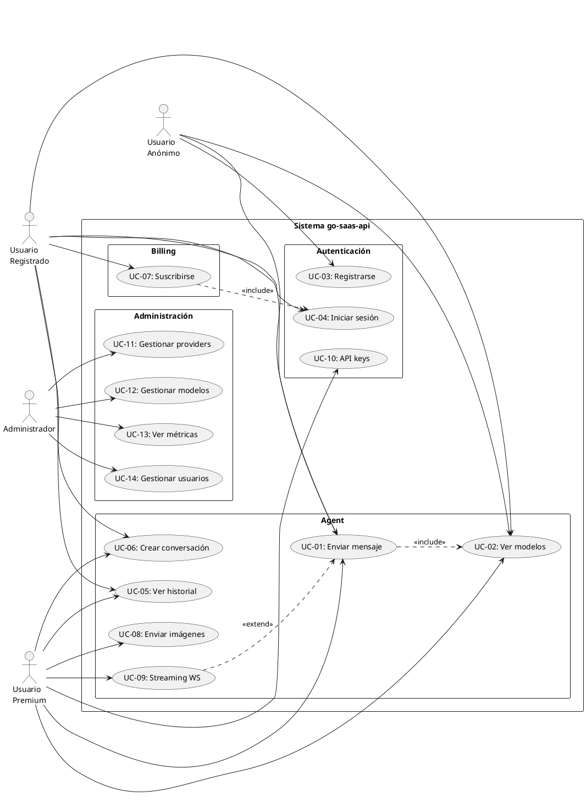
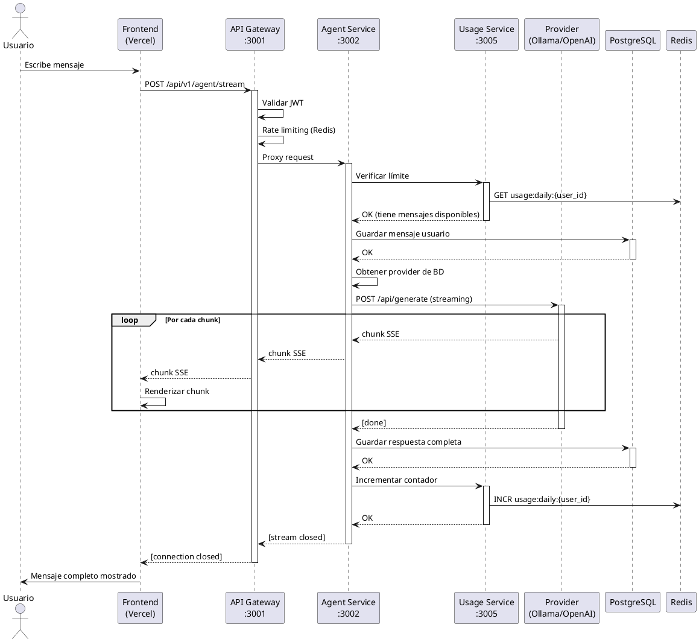
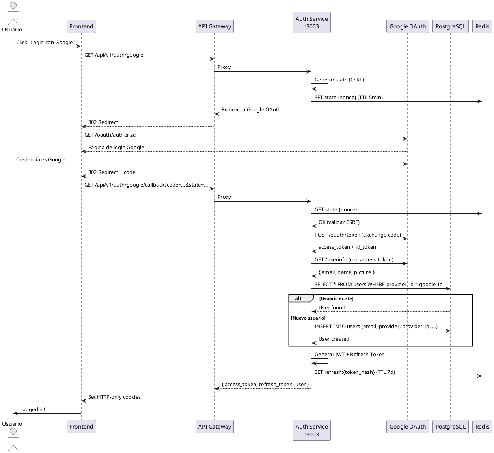
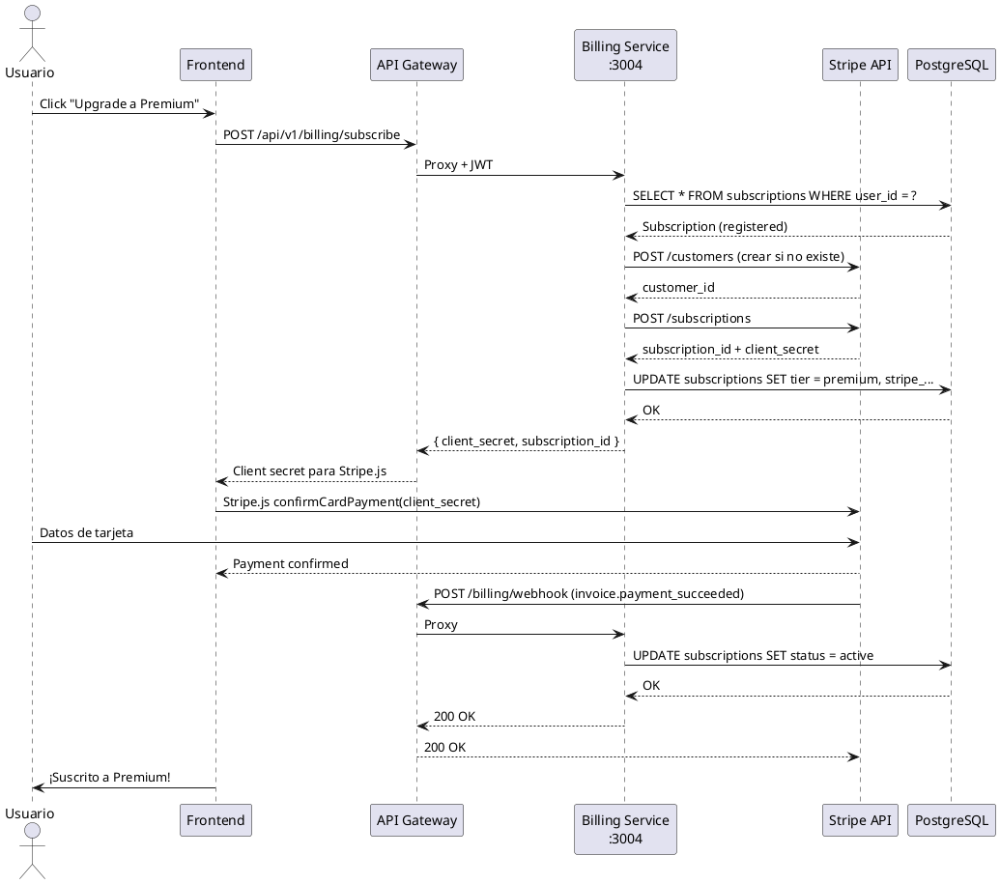
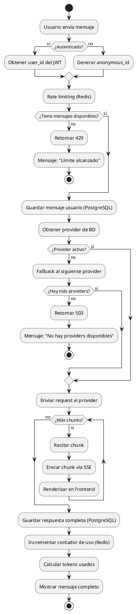
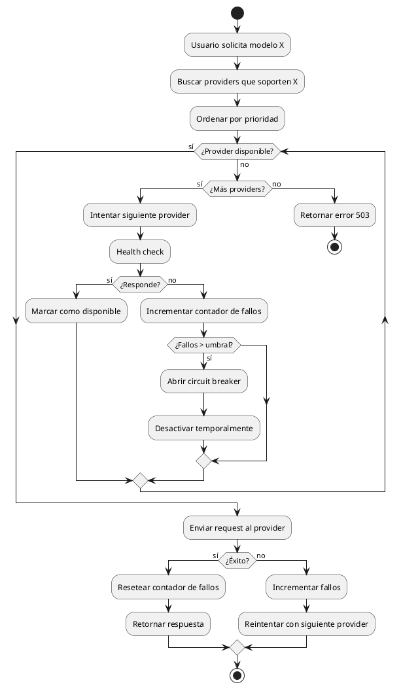
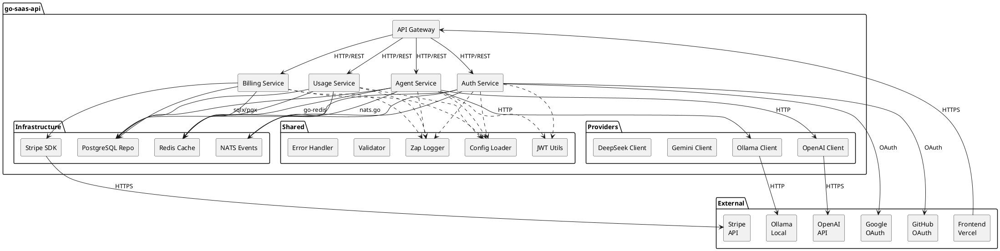
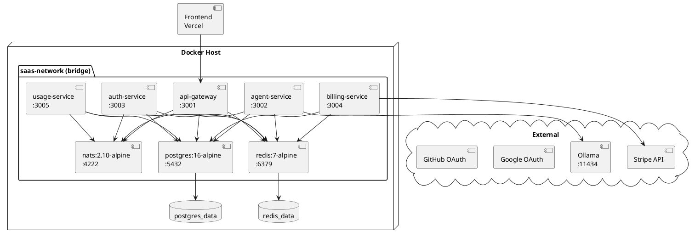
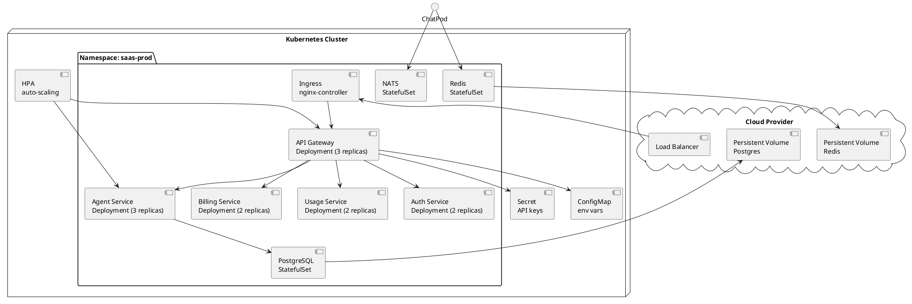

# go-saas-api — Documentación de Arquitectura UML

> **Proyecto:** Backend SaaS multi-tenant para chat AI
> **Stack:** Go 1.24 + Gin + PostgreSQL + Redis + NATS + Docker
> **Versión:** 1.0.0 | **Fecha:** Abril 2026

---

## 📋 Índice

1. [Visión del Sistema](#1-visión-del-sistema)
2. [Diagrama de Casos de Uso](#2-diagrama-de-casos-de-uso)
3. [Diagrama de Clases](#3-diagrama-de-clases)
4. [Diagrama de Secuencia](#4-diagrama-de-secuencia)
5. [Diagrama de Actividades](#5-diagrama-de-actividades)
6. [Diagrama de Componentes](#6-diagrama-de-componentes)
7. [Diagrama de Despliegue](#7-diagrama-de-despliegue)
8. [Modelo Entidad-Relación (BD)](#8-modelo-entidad-relación)
9. [Justificación de Decisiones](#9-justificación-de-decisiones)

---

## 1. Visión del Sistema

### 1.1 Propósito
Sistema backend que permite a usuarios (anónimos, registrados y premium) interactuar con múltiples modelos de IA (Ollama, OpenAI, Gemini, DeepSeek) mediante chat en tiempo real con streaming de respuestas.

### 1.2 Stakeholders
| Rol | Descripción |
|-----|-------------|
| **Usuario Anónimo** | Puede chatear sin registrarse (límite 3 msgs/día) |
| **Usuario Registrado** | Cuenta gratuita con 50 msgs/día, historial |
| **Usuario Premium** | Suscripción paga con 1000 msgs/día, imágenes |
| **Administrador** | Gestiona providers, modelos, config del sistema |
| **Developer** | Integra con la API pública usando API keys |

### 1.3 Alcance
- ✅ Chat con streaming SSE/WebSocket
- ✅ Múltiples providers de IA configurables en BD
- ✅ Autenticación JWT + OAuth (Google/GitHub)
- ✅ Subscripciones con Stripe
- ✅ Rate limiting por tier
- ✅ API pública con API keys
- ❌ Frontend (separado, en Vercel)
- ❌ Entrenamiento de modelos
- ❌ Voice/video chat

---

## 2. Diagrama de Casos de Uso

### 2.1 Actores
```
┌─────────────────┐  ┌─────────────────┐  ┌─────────────────┐  ┌─────────────────┐
│  Usuario        │  │  Usuario        │  │  Usuario        │  │  Admin          │
│  Anónimo        │  │  Registrado     │  │  Premium        │  │                 │
│  (Guest)        │  │  (Free)         │  │  (Paid)         │  │                 │
└────────┬────────┘  └────────┬────────┘  └────────┬────────┘  └────────┬────────┘
         │                    │                    │                    │
         └────────────────────┴────────────────────┘                    │
                              │                                       │
                              ▼                                       ▼
                    ┌─────────────────┐                    ┌─────────────────┐
                    │   Sistema de    │                    │   Panel de      │
                    │   Chat AI       │                    │   Administración│
                    └─────────────────┘                    └─────────────────┘
```

### 2.2 Casos de Uso por Actor

#### Usuario Anónimo
| ID | Caso de Uso | Descripción |
|----|-------------|-------------|
| UC-01 | Enviar mensaje | Chatear con IA sin registrarse |
| UC-02 | Ver modelos disponibles | Listar modelos públicos |
| UC-03 | Registrarse | Crear cuenta para más mensajes |

#### Usuario Registrado (hereda anónimo)
| ID | Caso de Uso | Descripción |
|----|-------------|-------------|
| UC-04 | Iniciar sesión | Login con email/password o OAuth |
| UC-05 | Ver historial | Ver conversaciones pasadas |
| UC-06 | Crear conversación | Nueva conversación con título |
| UC-07 | Actualizar a Premium | Suscribirse vía Stripe |

#### Usuario Premium (hereda registrado)
| ID | Caso de Uso | Descripción |
|----|-------------|-------------|
| UC-08 | Enviar imágenes | Adjuntar imágenes al chat |
| UC-09 | Streaming avanzado | WebSocket bidireccional |
| UC-10 | API keys | Generar keys para API pública |

#### Administrador
| ID | Caso de Uso | Descripción |
|----|-------------|-------------|
| UC-11 | Gestionar providers | CRUD de providers de IA |
| UC-12 | Gestionar modelos | CRUD de modelos disponibles |
| UC-13 | Ver métricas | Uso, errores, performance |
| UC-14 | Gestionar usuarios | Bloquear, cambiar tier |

### 2.3 Diagrama Visual (PlantUML)



---

## 3. Diagrama de Clases

### 3.1 Estructura de Paquetes (Clean Architecture)

```
┌─────────────────────────────────────────────────────────────────────────────┐
│                              PRESENTATION LAYER                              │
│  ┌─────────────┐  ┌─────────────┐  ┌─────────────┐  ┌─────────────┐        │
│  │  Delivery   │  │  Delivery   │  │  Delivery   │  │  Delivery   │        │
│  │  (HTTP/WS)  │  │  (HTTP)     │  │  (HTTP)     │  │  (HTTP)     │        │
│  │  agent      │  │  auth       │  │  billing    │  │  usage      │        │
│  └──────┬──────┘  └──────┬──────┘  └──────┬──────┘  └──────┬──────┘        │
├─────────┼────────────────┼────────────────┼────────────────┼────────────────┤
│         │                │                │                │                 │
│  ┌──────┴──────┐  ┌──────┴──────┐  ┌──────┴──────┐  ┌──────┴──────┐       │
│  │   UseCase   │  │   UseCase   │  │   UseCase   │  │   UseCase   │       │
│  │   agent     │  │   auth      │  │   billing   │  │   usage     │       │
│  └──────┬──────┘  └──────┬──────┘  └──────┬──────┘  └──────┬──────┘       │
├─────────┼────────────────┼────────────────┼────────────────┼────────────────┤
│         │                │                │                │                 │
│  ┌──────┴──────┐  ┌──────┴──────┐  ┌──────┴──────┐  ┌──────┴──────┐       │
│  │ Repository  │  │ Repository  │  │ Repository  │  │ Repository  │       │
│  │ Interface   │  │ Interface   │  │ Interface   │  │ Interface   │       │
│  │  (ports)    │  │  (ports)    │  │  (ports)    │  │  (ports)    │       │
│  └──────┬──────┘  └──────┬──────┘  └──────┬──────┘  └──────┬──────┘       │
├─────────┼────────────────┼────────────────┼────────────────┼────────────────┤
│         │                │                │                │                 │
│  ┌──────┴──────┐  ┌──────┴──────┐  ┌──────┴──────┐  ┌──────┴──────┐       │
│  │  Domain     │  │  Domain     │  │  Domain     │  │  Domain     │       │
│  │  (entities) │  │  (entities) │  │  (entities) │  │  (entities) │       │
│  └─────────────┘  └─────────────┘  └─────────────┘  └─────────────┘       │
├─────────────────────────────────────────────────────────────────────────────┤
│                           INFRASTRUCTURE LAYER                               │
│  ┌─────────────┐  ┌─────────────┐  ┌─────────────┐  ┌─────────────┐        │
│  │ PostgreSQL  │  │    Redis    │  │    NATS     │  │   Stripe    │        │
│  │  Repository │  │   Cache/    │  │   Events    │  │   Gateway   │        │
│  │  (adapters) │  │   Session   │  │             │  │             │        │
│  └─────────────┘  └─────────────┘  └─────────────┘  └─────────────┘        │
└─────────────────────────────────────────────────────────────────────────────┘
```

### 3.2 Clases del Dominio (Domain Layer)

#### Agent Domain
```go
// Message representa un mensaje en una conversación
type Message struct {
    ID             uuid.UUID
    ConversationID uuid.UUID
    UserID         *uuid.UUID  // nil para anónimos
    ModelID        *uuid.UUID  // ← FK a ai_models (para métricas)
    Role           MessageRole // user | assistant | system
    Content        string
    TokensUsed     int
    Attachments    []uuid.UUID // ← FKs a files
    CreatedAt      time.Time
}

// File adjunto a mensajes
type File struct {
    ID           uuid.UUID
    UserID       *uuid.UUID
    Name         string
    MimeType     string
    SizeBytes    int64
    StoragePath  string
    URL          string
    Metadata     map[string]interface{}
    CreatedAt    time.Time
}

// Conversation agrupa mensajes
type Conversation struct {
    ID        uuid.UUID
    UserID    *uuid.UUID
    Title     string
    ModelID   *uuid.UUID  // ← FK a ai_models
    Messages  []Message
    CreatedAt time.Time
    UpdatedAt time.Time
}

// ChatRequest solicitud de chat
type ChatRequest struct {
    Model       string
    Messages    []Message
    Stream      bool
    Temperature float64
    MaxTokens   int
}

// StreamChunk chunk de streaming
type StreamChunk struct {
    ID      string
    Content string
    Done    bool
    Error   error
}
```

#### Auth Domain
```go
// User entidad principal
type User struct {
    ID            uuid.UUID
    Email         string
    PasswordHash  *string     // nil para OAuth
    FirstName     *string
    LastName      *string
    AvatarURL     *string
    Role          UserRole    // super_admin | admin | user
    Provider      AuthProvider // local | google | github
    ProviderID    *string
    IsActive      bool
    EmailVerified bool
    TenantID      *uuid.UUID
    CreatedAt     time.Time
    UpdatedAt     time.Time
    LastLoginAt   *time.Time
}

// Session para refresh tokens
type Session struct {
    ID        uuid.UUID
    UserID    uuid.UUID
    TokenHash string
    ExpiresAt time.Time
    CreatedAt time.Time
}
```

#### Billing Domain
```go
// Subscription del usuario
type Subscription struct {
    ID                     uuid.UUID
    UserID                 uuid.UUID
    Tier                   SubscriptionTier   // free | registered | premium
    Status                 SubscriptionStatus // active | canceled | expired
    StripeCustomerID       *string
    StripeSubscriptionID   *string
    StripePriceID          *string
    StripeCurrentPeriodEnd *time.Time
    CreatedAt              time.Time
    UpdatedAt              time.Time
}

// Plan disponible
type Plan struct {
    ID              string
    Name            string
    MessagesPerDay  int
    PriceMonthly    float64
    Features        []string
}
```

#### AI Provider Domain (NUEVO — Escalable)
```go
// AIProvider configurable en BD
type AIProvider struct {
    ID              uuid.UUID
    Name            string          // "Ollama Local"
    Type            ProviderType    // ollama | openai | gemini | deepseek
    BaseURL         string          // http://host.docker.internal:11434
    APIKeyEncrypted *string         // AES-256
    APIKeyHash      *string         // SHA-256 para búsqueda
    IsActive        bool
    IsPublic        bool
    Priority        int             // Orden de fallback
    Config          ProviderConfig  // JSONB
    CreatedAt       time.Time
    UpdatedAt       time.Time
}

// AIModel catálogo de modelos
type AIModel struct {
    ID               uuid.UUID
    ProviderID       uuid.UUID
    Name             string  // "qwen2.5-coder:7b"
    DisplayName      string  // "Qwen 2.5 Coder 7B"
    MaxTokens        int
    ContextWindow    int
    SupportsStreaming bool
    SupportsImages   bool
    IsActive         bool
    IsPublic         bool   // Visible para free
    IsPremium        bool   // Solo premium
    Config           ModelConfig
}

// APIKey para API pública
type APIKey struct {
    ID         uuid.UUID
    UserID     uuid.UUID
    Name       string
    KeyHash    string     // SHA-256
    KeyPrefix  string     // "sk_live_"
    Permissions []string
    RateLimit  int        // RPM
    IsActive   bool
    LastUsedAt *time.Time
    ExpiresAt  *time.Time
}
```

### 3.3 Interfaces (Ports)

```go
// ChatRepository — puerto de salida
type ChatRepository interface {
    CreateConversation(ctx context.Context, conv *Conversation) error
    GetConversation(ctx context.Context, id uuid.UUID) (*Conversation, error)
    ListConversations(ctx context.Context, userID uuid.UUID, limit, offset int) ([]Conversation, error)
    SaveMessage(ctx context.Context, msg *Message) error
    GetMessages(ctx context.Context, conversationID uuid.UUID, limit, offset int) ([]Message, error)
}

// ChatUseCase — puerto de entrada
type ChatUseCase interface {
    SendMessage(ctx context.Context, req ChatRequest, userID *uuid.UUID) (*Message, error)
    StreamMessage(ctx context.Context, req ChatRequest, userID *uuid.UUID, stream chan<- StreamChunk) error
    ListModels(ctx context.Context, tier SubscriptionTier) ([]AIModel, error)
    GetHistory(ctx context.Context, conversationID uuid.UUID, limit, offset int) ([]Message, error)
}

// ProviderClient — abstracción de provider
type ProviderClient interface {
    StreamCompletion(ctx context.Context, req ChatRequest, stream chan<- StreamChunk) error
    HealthCheck(ctx context.Context) error
}
```

---

## 4. Diagrama de Secuencia

### 4.1 Chat con Streaming SSE



### 4.2 Autenticación OAuth Google



### 4.3 Suscripción Stripe



---

## 5. Diagrama de Actividades

### 5.1 Flujo de Chat Completo



### 5.2 Proceso de Fallback entre Providers



---

## 6. Diagrama de Componentes



---

## 7. Diagrama de Despliegue

### 7.1 Docker Compose (Desarrollo)



### 7.2 Kubernetes (Producción — Futuro)



---

## 8. Modelo Entidad-Relación

### 8.1 Diagrama ER

```plantuml
@startuml
!define table(x) class x << (T,#FFAAAA) >>
!define primary_key(x) <u>x</u>
!define foreign_key(x) #x

skinparam class {
    BackgroundColor White
    ArrowColor Black
    BorderColor Black
}

table(users) {
    primary_key(id): UUID
    email: VARCHAR(255) UNIQUE
    password_hash: VARCHAR(255)
    first_name: VARCHAR(100)
    last_name: VARCHAR(100)
    avatar_url: TEXT
    role: ENUM [super_admin, admin, user]
    provider: ENUM [local, google, github]
    provider_id: VARCHAR(255)
    is_active: BOOLEAN
    email_verified: BOOLEAN
    foreign_key(tenant_id): UUID
    created_at: TIMESTAMPTZ
    updated_at: TIMESTAMPTZ
    last_login_at: TIMESTAMPTZ
}

table(tenants) {
    primary_key(id): UUID
    name: VARCHAR(255)
    slug: VARCHAR(100) UNIQUE
    is_active: BOOLEAN
    created_at: TIMESTAMPTZ
    updated_at: TIMESTAMPTZ
}

Note: "Tabla reservada para futuro. Ahora tenant_id en users es NULL."

table(subscriptions) {
    primary_key(id): UUID
    foreign_key(user_id): UUID UNIQUE
    tier: ENUM [free, registered, premium]
    status: ENUM [active, canceled, expired]
    stripe_customer_id: VARCHAR(255) UNIQUE
    stripe_subscription_id: VARCHAR(255) UNIQUE
    stripe_price_id: VARCHAR(255)
    stripe_current_period_end: TIMESTAMPTZ
    created_at: TIMESTAMPTZ
    updated_at: TIMESTAMPTZ
}

table(conversations) {
    primary_key(id): UUID
    foreign_key(user_id): UUID
    title: VARCHAR(255)
    foreign_key(model_id): UUID
    created_at: TIMESTAMPTZ
    updated_at: TIMESTAMPTZ
}

table(files) {
    primary_key(id): UUID
    foreign_key(user_id): UUID
    name: VARCHAR(255)
    mime_type: VARCHAR(100)
    size_bytes: INT
    storage_path: TEXT
    url: TEXT
    metadata: JSONB
    created_at: TIMESTAMPTZ
}

table(messages) {
    primary_key(id): UUID
    foreign_key(conversation_id): UUID
    foreign_key(user_id): UUID
    foreign_key(model_id): UUID
    role: ENUM [user, assistant, system]
    content: TEXT
    tokens_used: INT
    attachments: UUID[]
    created_at: TIMESTAMPTZ
}

table(usage_records) {
    primary_key(id): UUID
    foreign_key(user_id): UUID
    anonymous_id: VARCHAR(255)
    foreign_key(model_id): UUID
    date: DATE
    message_count: INT
    tokens_used: INT
    created_at: TIMESTAMPTZ
    updated_at: TIMESTAMPTZ
}

table(ai_providers) {
    primary_key(id): UUID
    name: VARCHAR(100)
    type: ENUM [ollama, openai, gemini, deepseek, anthropic, custom]
    base_url: TEXT
    api_key_encrypted: TEXT
    api_key_hash: VARCHAR(64)
    is_active: BOOLEAN
    is_public: BOOLEAN
    priority: INT
    config: JSONB
    created_at: TIMESTAMPTZ
    updated_at: TIMESTAMPTZ
}

table(ai_models) {
    primary_key(id): UUID
    foreign_key(provider_id): UUID
    name: VARCHAR(100)
    display_name: VARCHAR(255)
    description: TEXT
    max_tokens: INT
    context_window: INT
    supports_streaming: BOOLEAN
    supports_images: BOOLEAN
    is_active: BOOLEAN
    is_public: BOOLEAN
    is_premium: BOOLEAN
    config: JSONB
    created_at: TIMESTAMPTZ
    updated_at: TIMESTAMPTZ
}

table(api_keys) {
    primary_key(id): UUID
    foreign_key(user_id): UUID
    name: VARCHAR(100)
    key_hash: VARCHAR(64)
    key_prefix: VARCHAR(8)
    permissions: JSONB
    rate_limit: INT
    is_active: BOOLEAN
    last_used_at: TIMESTAMPTZ
    expires_at: TIMESTAMPTZ
    created_at: TIMESTAMPTZ
    updated_at: TIMESTAMPTZ
}

' Relaciones
users "1" --> "0..1" subscriptions : posee
users "1" --> "0..*" conversations : crea
users "1" --> "0..*" messages : envía
users "1" --> "0..*" usage_records : genera
users "1" --> "0..*" api_keys : posee
users "1" --> "0..*" files : sube
conversations "1" --> "0..*" messages : contiene
ai_models "1" --> "0..*" conversations : usado_en
ai_models "1" --> "0..*" messages : genera
ai_models "1" --> "0..*" usage_records : trackea
ai_providers "1" --> "0..*" ai_models : provee
messages .> files : attachments

@enduml
```

### 8.2 Justificación del Schema

#### ¿Por qué multitenancy (`tenants`)?
- **Futuro:** Campo `tenant_id` en `users` es NULL ahora. Cuando vendamos a empresas, solo creamos la tabla `tenants` y populamos el campo.
- **Sin costo ahora:** No hay tabla `tenants`, no hay joins, no hay overhead.
- **Migración trivial:** `ALTER TABLE` no necesario, solo `INSERT INTO tenants` + `UPDATE users SET tenant_id = ...`

#### ¿Por qué `ai_models` como FK en `messages` y `usage_records`?
- **Métricas reales:** Podemos hacer `JOIN` para saber exactamente qué modelo generó qué tokens.
- **Tendencias:** `SELECT model_id, SUM(tokens_used) GROUP BY DATE_TRUNC('day', created_at)`
- **Costos:** Cada provider cobra diferente. Con FK podemos calcular costo real por provider/modelo.
- **Sin duplicación:** El nombre del modelo no se repite en cada mensaje (normalización).

#### ¿Por qué `files` separado (no Base64 en `messages`)?
- **Tamaño:** Un Base64 de una imagen ocupa ~33% más. Una imagen de 1MB = 1.33MB en BD.
- **Performance:** PostgreSQL no está optimizado para BLOBs grandes. Filesystem sí.
- **CDN-ready:** `files.url` puede apuntar a S3/CloudFront en el futuro sin cambiar código.
- **Metadata:** `width`, `height`, `duration` en JSONB para el frontend.

#### ¿Por qué `ai_providers` + `ai_models` en BD?
- **Sin deploy para agregar providers:** Admin agrega OpenAI, Anthropic, etc. desde el panel
- **API keys encriptadas:** AES-256 en BD, no en `.env` — rotación sin restart
- **Fallback automático:** Priority en BD define orden de fallback
- **Circuit breaker:** Contador de fallos por provider en BD

#### ¿Por qué `usage_records` separado de `messages`?
- **Performance:** Rate limiting consulta `usage_records` (1 row por día), no cuenta `messages` (miles de rows)
- **Sliding window:** Redis Sorted Sets para rate limit en tiempo real
- **Analytics:** `usage_records` permite agregaciones rápidas por día/semana/mes

#### ¿Por qué `api_keys`?
- **API pública:** Developers pueden integrar chat en sus apps
- **Rate limiting independiente:** Cada key tiene su propio límite RPM
- **Revocación instantánea:** `is_active = false` sin afectar al usuario
- **Auditoría:** `last_used_at` para trackear uso

#### ¿Por qué JSONB en `config`?
- **Flexibilidad:** Cada provider tiene config diferente (temperature, top_p, etc.)
- **Sin migrations por config nueva:** Agregar campo JSON no requiere ALTER TABLE
- **Indexable:** PostgreSQL permite índices GIN sobre JSONB para búsquedas

---

## 9. Justificación de Decisiones

### 9.1 ¿Por qué Clean Architecture (Hexagonal)?

| Problema | Solución | Beneficio |
|----------|----------|-----------|
| Código acoplado a framework | Domain no depende de Gin/HTTP | Testable sin servidor |
| Cambio de BD costoso | Repository como interfaz | Swap PostgreSQL → Mongo sin tocar lógica |
| Cambio de provider costoso | ProviderClient como interfaz | Agregar Anthropic = 1 archivo nuevo |
| Testing difícil | UseCase puro, sin side effects | Tests unitarios rápidos |

```
┌─────────────────────────────────────────┐
│  Delivery (HTTP/Gin)                    │  ← Framework, fácil de cambiar
│  └── Handlers → UseCase                 │
├─────────────────────────────────────────┤
│  UseCase (lógica de negocio)            │  ← Puro Go, testable
│  └── Repository Interface               │
├─────────────────────────────────────────┤
│  Repository (PostgreSQL)                │  ← Implementación, swapeable
│  └── sqlx/pgx                           │
└─────────────────────────────────────────┘
```

### 9.2 ¿Por qué Microservicios vs Monolito?

| Aspecto | Microservicios | Monolito (NestJS actual) |
|---------|---------------|-------------------------|
| **Escalabilidad** | Escalar solo Agent Service si hay pico | Escalar todo o nada |
| **Deploy** | Deploy de billing sin afectar chat | Deploy completo |
| **Equipo** | Equipos independientes | Coordinación total |
| **Complejidad** | Más complejo (network, observability) | Más simple |
| **Recursos** | Más consumo (múltiples procesos) | Menor consumo |

**Decisión:** Microservicios porque:
1. El chat service necesita escalar diferente (CPU-intensive streaming)
2. Billing es crítico, no puede caerse si chat falla
3. Auth es stateless, fácil de replicar

### 9.3 ¿Por qué Go 1.24?

| Feature | Beneficio |
|---------|-----------|
| **Go Routines** | 10,000+ conexiones concurrentes con < 10MB RAM |
| **Channels** | Pipeline de streaming: Provider → Chunk → SSE |
| **Context** | Cancelación graceful de requests largos |
| **Single Binary** | Deploy simple: `go build` = 1 ejecutable |
| **Performance** | 10x más rápido que Node.js en I/O bound |
| **Go Workspaces** | `go.work` permite múltiples módulos sin replace directives |

### 9.4 ¿Por qué PostgreSQL + Redis (no solo PostgreSQL)?

| Dato | PostgreSQL | Redis |
|------|-----------|-------|
| **Rate limiting** | Lento (COUNT con WHERE) | O(1) con Sorted Sets |
| **Sessions** | Disk I/O | RAM, TTL automático |
| **Cache** | No | Sí, TTL configurable |
| **Pub/Sub** | LISTEN/NOTIFY limitado | Nativo, escalable |
| **Durabilidad** | Sí (ACID) | No (ephemeral) |

**PostgreSQL:** Datos persistentes (users, messages, subscriptions)
**Redis:** Datos temporales (sessions, rate limits, cache, pub/sub)

### 9.5 ¿Por qué NATS (no RabbitMQ/Kafka)?

| Aspecto | NATS | RabbitMQ | Kafka |
|---------|------|----------|-------|
| **Setup** | 1 binario, 0 deps | Erlang + plugins | ZooKeeper + brokers |
| **Memoria** | < 50MB | > 200MB | > 1GB |
| **Latency** | < 1ms | ~5ms | ~10ms |
| **Go SDK** | Nativo, simple | amqp | sarama (complejo) |
| **JetStream** | Persistencia opcional | Nativo | Nativo |
| **Escalabilidad** | Horizontal simple | Cluster complejo | Cluster complejo |

**Decisión:** NATS porque es Go-native, liviano, y JetStream da persistencia si la necesitamos.

### 9.6 ¿Por qué SSE + WebSocket?

| Protocolo | Caso de Uso | Ventaja |
|-----------|-------------|---------|
| **SSE** | Streaming unidireccional (server → client) | Simple, HTTP nativo, auto-reconnect |
| **WebSocket** | Bidireccional (chat + cancelación) | Full-duplex, baja latencia |

**Decisión:** Ambos:
- SSE por defecto (más simple, funciona con proxies corporativos)
- WebSocket para cancelación de generación y features avanzadas

---

## 📎 Anexos

### A. Glosario
| Término | Definición |
|---------|-----------|
| **Provider** | Servicio externo de IA (Ollama, OpenAI, etc.) |
| **Model** | Modelo específico dentro de un provider (GPT-4, Qwen) |
| **Tier** | Nivel de suscripción (free, registered, premium) |
| **Chunk** | Fragmento de respuesta en streaming |
| **Circuit Breaker** | Patrón que evita reintentar servicios caídos |
| **Port** | Interfaz en Clean Architecture (entrada/salida) |
| **Adapter** | Implementación concreta de un Port |

### B. Queries de Métricas (Analytics)

```sql
-- 1. Tokens por modelo (últimos 30 días)
SELECT 
    p.name as provider,
    am.display_name as modelo,
    COUNT(*) as mensajes,
    SUM(m.tokens_used) as tokens_total,
    AVG(m.tokens_used)::INT as tokens_promedio
FROM messages m
JOIN ai_models am ON m.model_id = am.id
JOIN ai_providers p ON am.provider_id = p.id
WHERE m.created_at >= NOW() - INTERVAL '30 days'
GROUP BY p.name, am.display_name
ORDER BY tokens_total DESC;

-- 2. Uso por tier de suscripción
SELECT 
    COALESCE(s.tier, 'anonymous') as tier,
    COUNT(DISTINCT m.user_id) as usuarios_activos,
    COUNT(*) as mensajes,
    SUM(m.tokens_used) as tokens
FROM messages m
LEFT JOIN users u ON m.user_id = u.id
LEFT JOIN subscriptions s ON u.id = s.user_id
WHERE m.created_at >= NOW() - INTERVAL '7 days'
GROUP BY s.tier;

-- 3. Tendencia de uso por día
SELECT 
    DATE_TRUNC('day', m.created_at) as dia,
    COUNT(*) as mensajes,
    SUM(m.tokens_used) as tokens
FROM messages m
WHERE m.created_at >= NOW() - INTERVAL '30 days'
GROUP BY dia
ORDER BY dia;

-- 4. Costo estimado por provider
SELECT 
    p.name as provider,
    SUM(m.tokens_used) as tokens,
    SUM(m.tokens_used) * 0.000002 as costo_usd  -- $2/M tokens
FROM messages m
JOIN ai_models am ON m.model_id = am.id
JOIN ai_providers p ON am.provider_id = p.id
WHERE m.created_at >= NOW() - INTERVAL '30 days'
GROUP BY p.name;

-- 5. Top modelos más usados (para decidir qué mantener)
SELECT 
    am.display_name,
    COUNT(*) as total_usos,
    COUNT(DISTINCT m.user_id) as usuarios_unicos
FROM messages m
JOIN ai_models am ON m.model_id = am.id
WHERE m.created_at >= NOW() - INTERVAL '30 days'
GROUP BY am.display_name
ORDER BY total_usos DESC
LIMIT 10;
```

### C. Referencias
- [Clean Architecture — Robert C. Martin](https://blog.cleancoder.com/uncle-bob/2012/08/13/the-clean-architecture.html)
- [Go Concurrency Patterns](https://go.dev/blog/pipelines)
- [PostgreSQL JSONB](https://www.postgresql.org/docs/current/datatype-json.html)
- [NATS Documentation](https://docs.nats.io/)
- [Stripe Go SDK](https://github.com/stripe/stripe-go)

---

*Documento creado: Abril 2026 | Versión 1.0 | Autor: Hermes Agent*
